#arduino esp32接入物联网通信云平台
------------
###本实践使用arduino平台esp32 wrover-b开发板连接上物联网通信云平台（UIoT Core），实现mqtt消息的发布与订阅
##一、环境准备
###1.下载并安装arduino IDE,[点击选择下载方式](https://www.arduino.cn/thread-5838-1-1.html)

###2.完成安装之后，打开IDE，安装ESP32包，步骤如下：

点击文件->首选项，弹出对话框

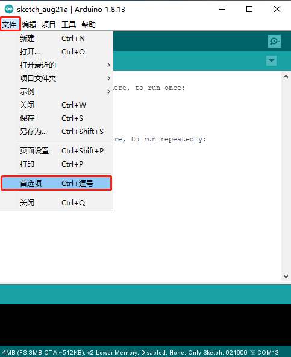

按如图所示，点击1处方框，将 https://dl.espressif.com/dl/package_esp32_index.json 填入，点击好，保存

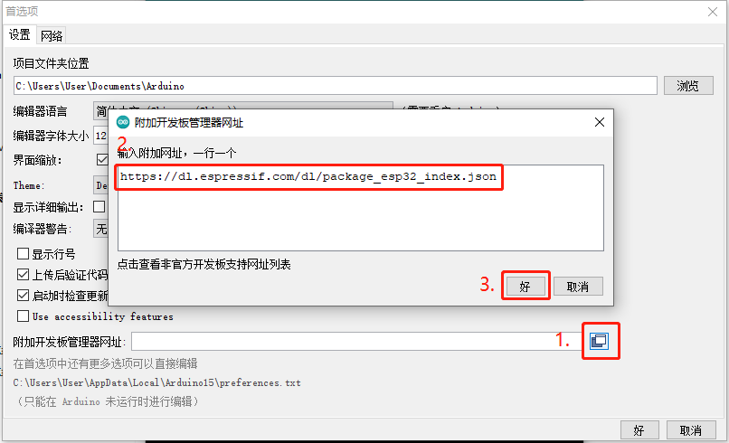

点击工具->开发板->开发板管理器，弹出对话框

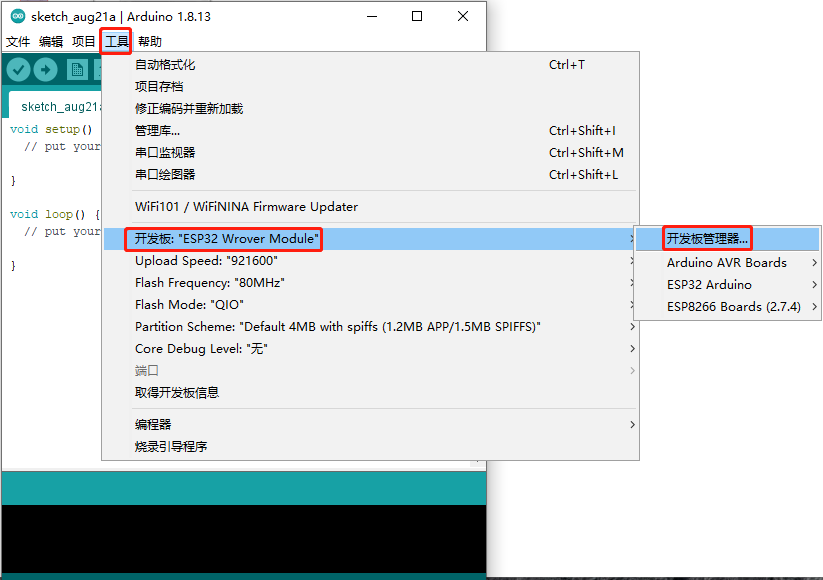

等待下载完成之后，安装

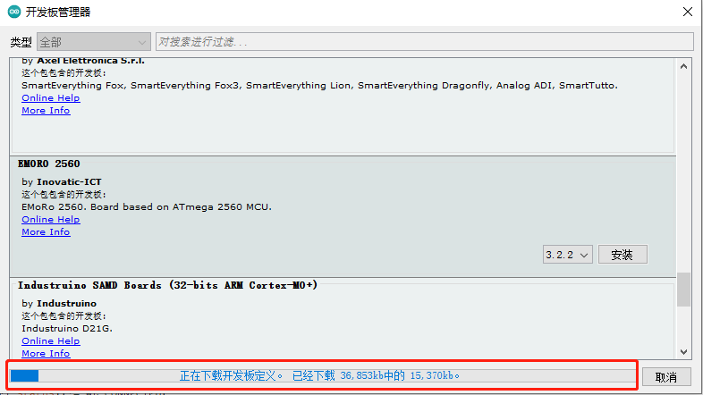

下载完成之后点击搜索框搜索esp32，点击安装，安装完成之后显示INSTALLED

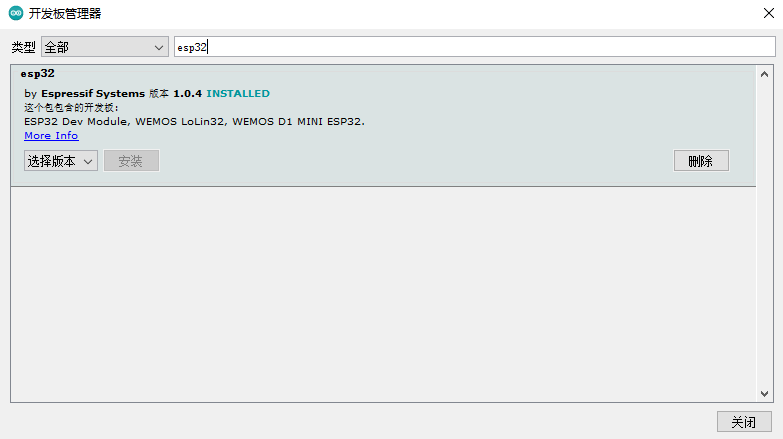

esp32开发板安装完成！

###3.安装依赖库
点击 工具->管理库，弹出对话框

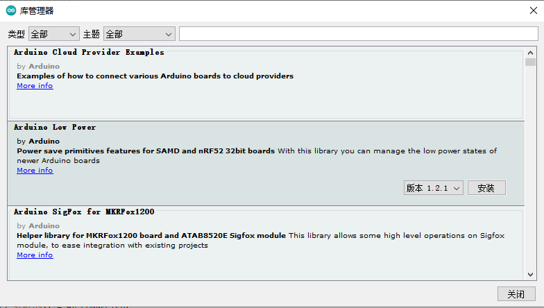

安装PubSubClient库，在搜索框中粘贴```PubSubClient```，找到该名称**对应的库**，并安装

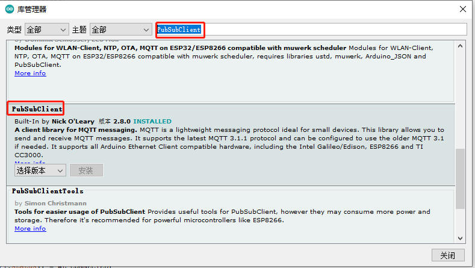

安装ArduinoJson库，在搜索框中粘贴```Arduino_JSON```，找到该名称**对应的库**，并安装


安装UCloudIoTSDK库,在搜索框中粘贴```UCloudIoTSDK```，找到该名称**对应的库**，并安装

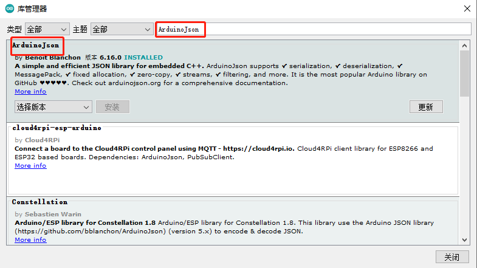

###4.开发板设置

用USB--连接上开发板,将开发板信息设置为如图所示(该设置仅仅针对该款ESP32,其它请自行查阅资料确认如何设置)

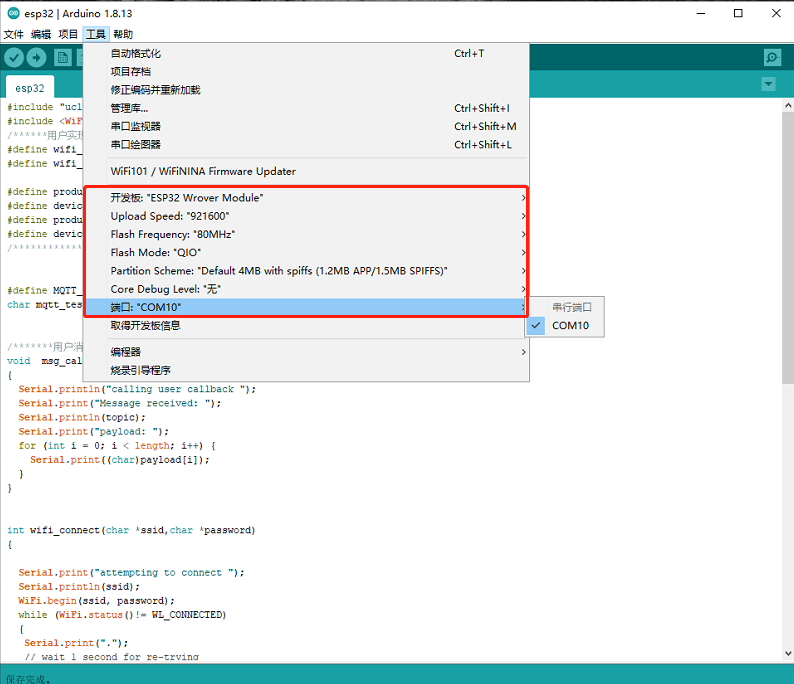

##二、程序编写

###1.首先包含sdk头文件以及连接wifi所需头文件。
###2.设置wifi ssid以及password。
###3.设置连接物联网通信平台需要的信息，该部分信息必须在物联网通信平台[创建产品以及设备](https://docs.ucloud.cn/uiot-core/console_guide/product_device/create_products)之后获得。```product_sn``` 和```device_sn```必填。[静态连接](https://docs.ucloud.cn/uiot-core/device_develop_guide/authenticate_devices/unique-certificate-per-device_authentication)时，将```product_secret```置为NULL并填写```device_secret```。[动态注册](https://docs.ucloud.cn/uiot-core/device_develop_guide/authenticate_devices/unique-certificate-per-product_authentication)时将```device_secret```置为NULL并填写```product_secret```。
###4.定义mqtt测试topic。
###5.设置用户消息回调函数，该回调函数在mqtt收到消息之后调用。
###6.wifi连接过程
###7.根据四元组信息以及回调函数构造UCloudMQTT对象
###8.setup里面进行wifi连接以及mqtt连接，订阅测试topic
###9.loop里面进行消息接收以及每两秒发布一条测试topic的消息
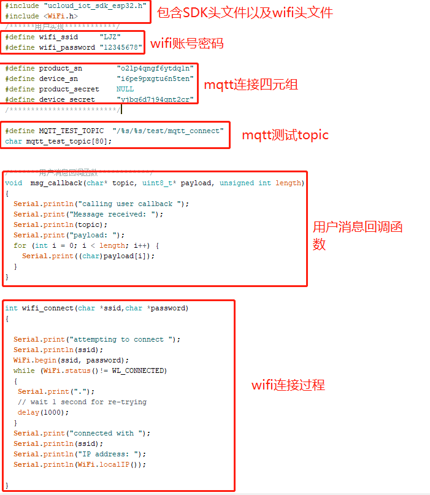
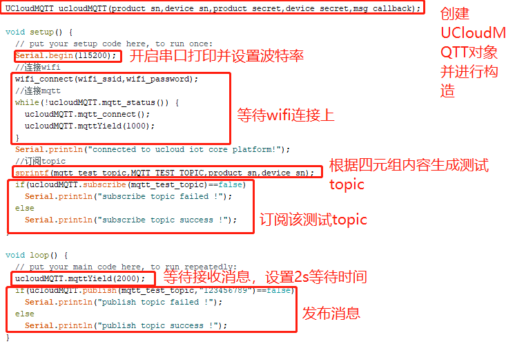

##三、烧录以及现象
###1.烧录
点击图中→方向，点击之后开始编译，编译通过后自动下载到开发板
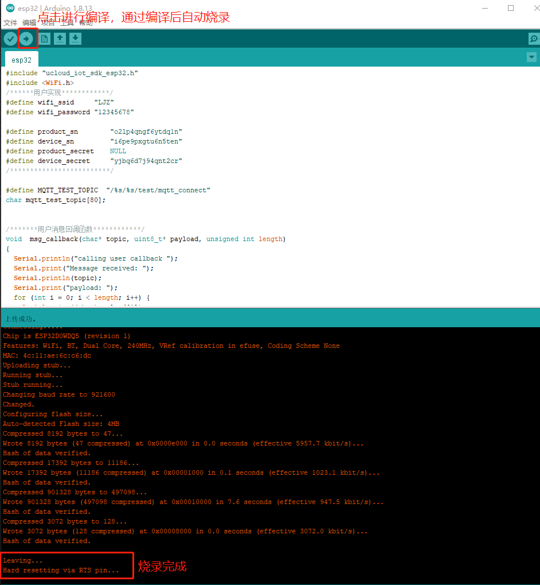

###2.现象
使用串口工具连接esp32串口，看到如图所示有wifi连接成功，mqtt连接成功。以及订阅发布成功的log。
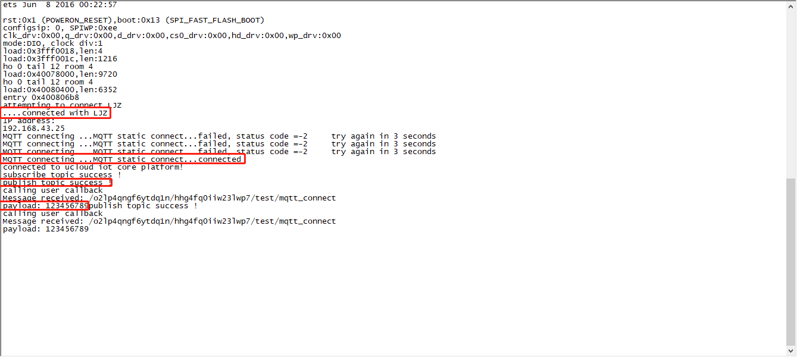

##四、注意事项
###1.编译出现有些文件找不到，请确认是否将必要的库安装成功
###2.烧录不了，确认arduino IDE能够读取到端口信息，如果开发板端口连接到其他串口工具，将会造成烧录失败

##五、拓展
###该例程只演示了使用静态连接连上物联网通信云平台，此外SDK还有动态注册，以及TLS加密连接功能。想要使用动态注册只需要将四元组信息的```device_sn```置为NULL,并且正确填写四元组的其他三个信息。如果想要使用TLS加密连接，找到库文件，将库文件中的```ucloud_iot_sdk_esp32.h```打开，将```ENABLE_TLS```宏打开即可
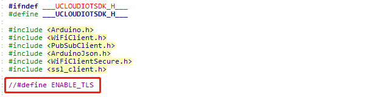

##六、API参考
###1.构造对象接口
要使用该库进行mqtt连接到物联网通信云平台时，需要首先构建UCloudMQTT对象，使用到以下接口：  
UCloudMQTT(  
char *product_sn,  
char *device_sn,  
char *product_secret,  
char *device_secret,  
MQTTHandlerFun  callback  
);    
参数：```product_sn```，指向存有产品序列号字符串的指针  
参数：```device_sn``` ，指向存有设备序列号字符串的指针  
参数：```product_secret```，指向存有产品秘钥字符串的指针  
参数：```device_secret``` ，指向存有设备秘钥字符串的指针  
参数：```callback```，用户消息回调函数指针  
使用示例：
```UCloudMQTT ucloudMQTT(product_sn,device_sn,product_secret,device_secret,msg_callback);```

###2.MQTT连接接口
int mqtt_connect(void);
返回值： 0-连接成功  1-连接失败  
使用示例：```mqtt_connect();```

###3.延时等待接收MQTT消息接口
void mqttYield(int time_ms);  
参数：```time_ms```，延时等待的时间，ms为单位。  
使用示例：```mqttYield(2000);```

###4.查询MQTT状态接口
boolean   mqtt_status(void);  
返回值： true-处于连接状态  false-断开状态  
使用示例：```mqtt_status();```  

###5.MQTT发布接口
boolean   publish(  
const char* topic,  
const char* payload  
);  
参数：```topic```，消息TOPIC   
参数：```payload```，消息内容  
返回值：true-发布成功  false-发布失败  
使用示例：```publish(MSG_TOPIC,"123456");``` 

###6.MQTT订阅接口  
boolean   subscribe(const char* topic);  
参数：```topic```，订阅的TOPIC  
返回值：true-订阅成功  false-订阅失败  
使用示例：```subscribe(MSG_TOPIC);```   

-------------
#结束